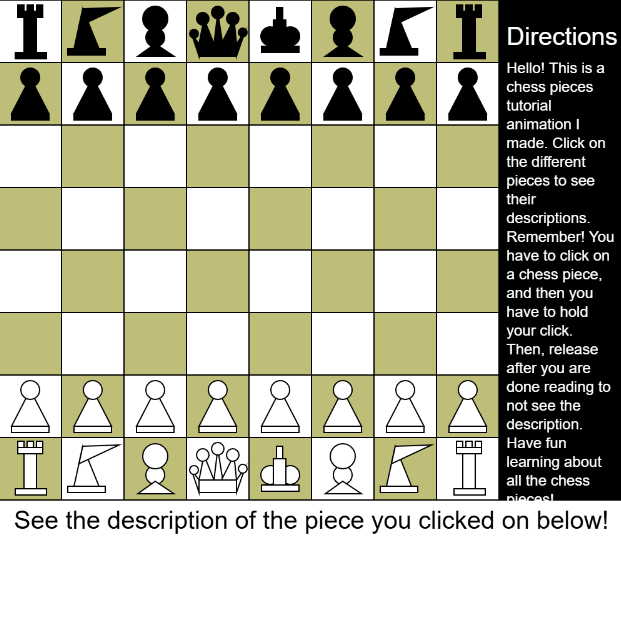

# Chess Pieces Tutorial — p5.js

  

## Overview
This is an **interactive chess tutorial** built with [p5.js](https://p5js.org/). Click and hold on the different chess pieces to see their descriptions and learn how they move.  

This project was originally my **first major programming challenge**, completed back in **5th grade** on Khan Academy. In 10th grade, I ported it to **p5.js**, improving structure, interactivity, and readability.  

It demonstrates basic graphics programming, loops, functions, event handling, and user interaction in JavaScript.

## Features
- Full chessboard with all standard pieces (pawns, rooks, knights, bishops, queen, king)
- Click-and-hold descriptions for each piece
- Interactive and educational, designed to teach chess basics
- Built entirely with **p5.js** graphics library
- Portable and easy to run in a browser

## How to Run
1. Clone or download this repository.
2. Open `index.html` in a web browser.
3. Click and hold a chess piece to see its description.

Or try it online via **[GitHub Pages](https://prajwalb19.github.io/graphical-chess-tutorial/)**.

## File Structure
```
chess-tutorial/
├── index.html    # Entry point, loads p5.js + sketch.js
├── sketch.js     # Main p5.js code for chessboard & pieces
├── style.css     # Responsive styling
├── screenshot.png # Screenshot for README
└── README.md     # This file
```

## Future Improvements
- Add proper color coding for white and black pieces
- Include movement animations and legal move highlights
- Create interactive chess puzzles or mini-exercises
- Improve mobile/touch support
- Add sound effects or hover interactions

## About Me
I have been programming since 5th grade, and this project marks my **first major milestone**. Since then, I’ve continued exploring projects in Python, machine learning, web development, and creative coding.  

This project represents both my **early journey in programming** and my **growth over the years** in building interactive applications.

---

Enjoy exploring the chess pieces!